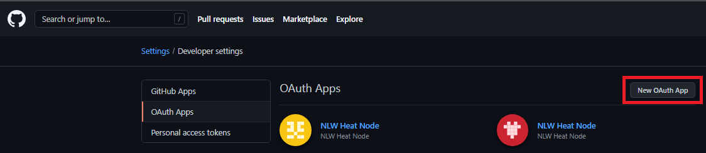
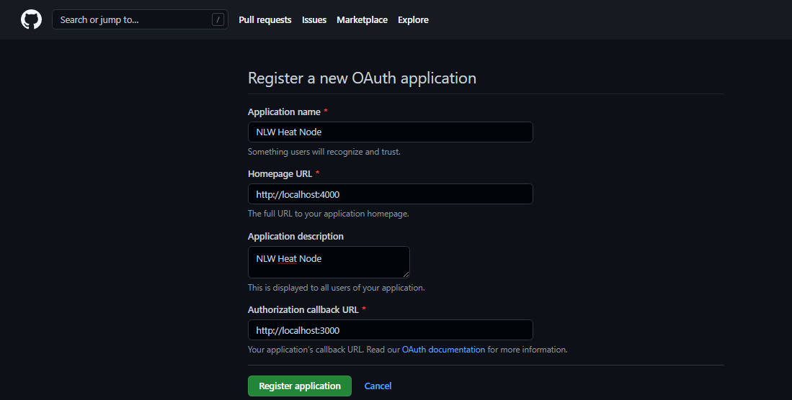
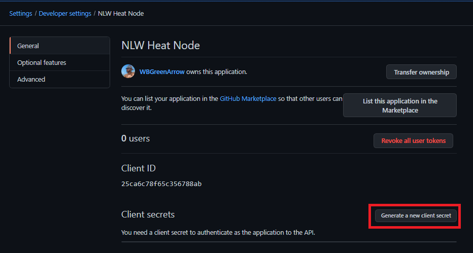
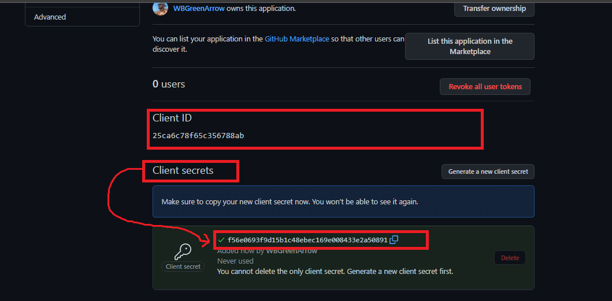
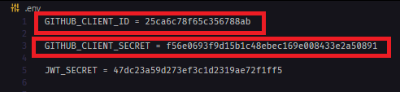

<table align="center">
 
 <tr>
  
  <td align="center" width="9999">
   


<br>

# NLW HEAT

Uma aplicação feita com NodeJS, ReactJS e ReactNative, que utiliza a API do Github para fazer a autentiação e obtenção dos dados do usuário.

   <br>

 </tr>
 
</table>

<br>

# 🎨 Telas da Aplicação Web.


<br>

# 🎨 Telas da Aplicação Mobile.


<br>

# 📃 Sobre o projeto

Uma aplicação que lista e registra em tempo real, as mensagens cadastradas pelo usuario.

Desenvolvido durante o evento #NLW-Heat da RocketSeat.

<br>
<br>

# Funcionalidades

-   Listar em tempo real as útilmas 3 messagens salvas pelo usuário

-   Registrar uma nova mensagem

<br><br>

# 🛠 Tecnologias utilizadas

## Back-End

-   NodeJS
-   TypeScript
-   Express
-   Prisma ORM
-   Socket.IO
-   SQL-Lite
-   JSONWebToken
-   Axios

<br>

## Frot-End

-   ReactJS
-   TypeScript
-   React-Icons
-   Sass
-   Socket.IO - Client
-   Axios

<br>

## Mobile

-   ReactNative
-   TypeScript
-   Expo
-   Moti
-   Socket.IO - Client
-   Axios

<br>

# 🚀 Rodando o projeto

A aplicação é dividida em 3 partes:<br>

<b>node_heat</b> : é aplicação back-end responsável pela autenticação com github, e gerenciar as regras de negócio.<br>

<b>web</b> : aplicação web front-end.<br>

<b>nlwheatapp</b> : aplicação mobile

## Pré-requisitos

-   Git
-   NodeJS
-   Yarn
    <br>
    <br>

# Configurando Back-End

Clone o repositório

```bash
# Clone o repositório
git clone https://github.com/WBGreenArrow/NLW_Heat-.git
```

## Pegando Client_ID e Client_Secret no GitHub para aplicação web

<p>Acesse github: <b>https://github.com/settings/developers</b> e faça o login com sua conta. Após fazer o login navegue até OAuth Apps e click em <b>New OAuth App</b>.

<br>
<br>


<br>
<br>

Agora vamso registrar uma nova aplicação no nosso perfil do github. Preencha os campos igual imagem abaixo.



<br>
<br>

<p>Após prencher os campos, click em <b>Register Aplication</b>.
Depois de registrar a aplicação é hora de gerar o SECRET_KEY

Click em <b>Generate new client secret</b>


<br>
<br>

<p>Agore pegue o <b>Client ID</b> e o <b>Client Secret</b></p>



Com esse dados em mãos é hora de "setar" no back-end :)

Acesse a pasta <b>node_heat</b> e abra o arquivo <b>.env</b> , altere o valor da variável GITHUB_CLIENT_ID com o Client_ID, e GITHUB_CLIENT_SECRET com Client_Secret.
<br>



<br>

Salve as alterações feita no arquivo <b>.env</b>. Agora vamos rodar o nosso back-end :)

<br>

## 💻 Rodando o Back-End

Navegue até a pasta do projeto clonado e execute os comandos abaixo

```bash
# Entra na pasta da node_heats
cd node_heats

# Instala as dependências
npm install
```

Após concluir a instalação das dependências, ainda no terminal da pasta do back-end execute o comando abaixo

```bash
# Inicia a aplicação back-end
yarn start
```

<br>

## 🖥 Rodando o Front-End

Precisamos fazer uma pequena configuração.

Navegue até a pasta <b>Context</b> e abra o arquivo <b>auth</b>

Vamos passar para variável CLIENT_ID o Client_ID que pegamos no github.


Salve as alterações feias no arquivo, e vamos rodar o front-end.

Navegue até a pasta raiz do front-end e execute os comandos abaixo

```bash
# Entra na pasta do front-end
cd web

# Instala as dependências
npm install
```

Após concluir a instalação das dependências, ainda no terminal da pasta do front-end execute o comando abaixo.

```bash
# Inicia a aplicação
yarn start

# Após isso a aplicação pode ser utilizada acessando o endereço http://localhost:3000
```
